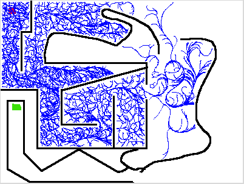

An implementation of the RRT algorithm as presented in [1], and an application
of it to a model of a robot in the 2D plane with a positional and angular
velocity.

[1] - http://msl.cs.uiuc.edu/~lavalle/papers/LavKuf01b.pdf



Running the damn thing
======================

Ensure that the ROS core is running. Then, you can run the following programs:

```
./src/rrt_viz.py data/small_maze.png
```
```
./src/rrt_planner.py "(22, 17, 0, 0, 0)" "(23, 175, 0, 0, 0)" ../data/easy_to_move_in_maze.png
```

The first parameter to `rrt_planner` is the initial state. The second is the
destination state. Then the path to the file with the map in it. This is
expected to be some image that pillow can load, where pixel values `(0, 0, 0,
x)` (black with any transparnecy) represent the presence of an obstacle at
that point. All other values are considered to be free space, so feel free to
doodle on the map!

Right now the robot is assumed to be a 7x7 square. Additionally, various
physical parameters of the robot such as its max speed and acceleration are
hard-coded into the ROS node.

It will take a long time, but make a very pretty picture :) Unfortunately,
Stage seems to crash on the world file I want to give it. But, it's very
straightforward to add Twist message sending. Would simply need to follow
parent points from the node that reached the destination to get to the root,
and then emit Twist messages representing the control inputs which are stored
as edge data on each edge in the tree.

Further Directions
==================

One thing to do would be to add more models. The holonomic turtle isn't
terribly interesting, as simpler and more efficient algorithms can be used for
holonomic actors in low dimensions. Additionally, doing some heuristics to
guide the tree growth instead of the random sampling I'm doing right now would
probably yield more interesting results. Especially if it were to integrate
knowledge of the map in a smarter way.

Status
======

- [x] Core RRT algorithm
- [x] Turtlebot motion model
- [x] Nearest-neighbor query for turtlebot
- [x] Convex collision for `SimpleMap`.
- [x] Visualizer of the RRT as it's built
- [ ] Multi-tree planner
- [x] Integrate planner into ROS control node
- [ ] RRT parameter tweak GUI
- [x] Instructions for running.
- [x] Investigate efficacy of `scipy.optimize.minimize` in this usecase.
- [ ] Stage integration
